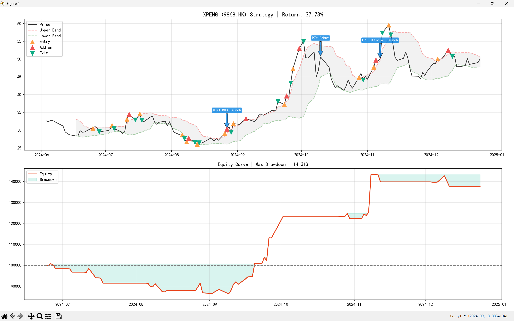

# XPeng (9868.HK) Algorithmic Trading System 📈

### 📖 Project Overview
A quantitative trading system designed for **XPeng Motors (9868.HK)**, implementing a **Hybrid Trend-Following Strategy** combined with **Pyramiding Position Management**. 

The system captures high-volatility trends while managing downside risk through trailing stops. It also overlays major business events (e.g., product launches) to visualize the correlation between fundamentals and technical price action.

### 🚀 Key Features
* **Hybrid Signal Engine:** Combines **Bollinger Bands** (Trend) and **RSI** (Momentum) to identify high-probability swing trade opportunities.
* **Pyramid Position Sizing:** * **Entry:** Opens a 50% initial position on trend breakout.
    * **Add-on:** Aggressively scales in (All-in) after 3% floating profit confirmation.
* **Risk Management:** Implemented a tight **3% Trailing Stop** to protect profits in volatile markets.
* **Event-Driven Analysis:** Automatically annotates charts with key business milestones (e.g., MONA M03 Launch, P7+ Debut).

### 📊 Backtest Performance (2024.06 - 2024.12)
* **Total Return:** **+37.73%** 📈
* **Max Drawdown:** **-14.31%**
* **Performance Analysis:** The strategy successfully captured the major trend during the Sep-Oct rally while avoiding chop during the consolidation phase. Using a standard **20-day Moving Average** ensures the strategy's robustness and prevents overfitting.


*(Chart generated by the system)*

### 🛠️ Tech Stack
* **Language:** Python 3.10+
* **Data Analysis:** Pandas, NumPy
* **Data Feed:** yfinance (Real-time market data)
* **Visualization:** Matplotlib
* **NLP (Optional):** Jieba (For sentiment analysis module)

### 💻 How to Run
1. Clone the repository:
```bash
git clone [https://github.com/Zywoonk/XPeng-Quant-Trading-System.git](https://github.com/Zywoonk/XPeng-Quant-Trading-System.git)

```

2. Install dependencies:

pip install -r requirements.txt

3. Run the strategy:

python main.py

```

### ⚠️ Disclaimer

This project is for educational and research purposes only. It does not constitute financial advice.

```

---


